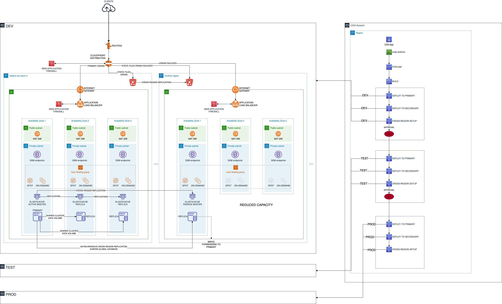
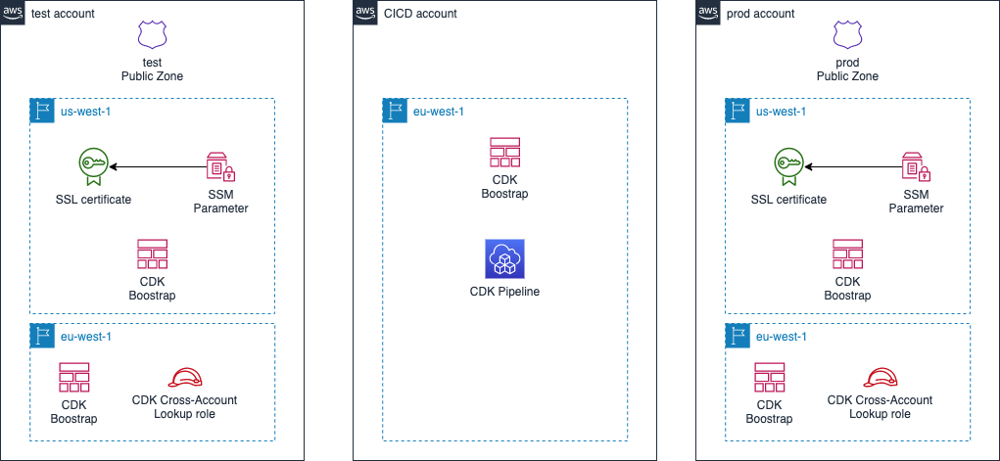

# AWS EMEA Principal Architect Hiring Assignment

This repository is a proof-of-concept implementation of the proposed solution (short term) design for the assignment.

It includes the new Application Load Balancer with autoscaling group and scaling policy.

It also implements the static file serving separatation through CloudFront and an S3 bucket, including cross-region deployment of digital certificates for CloudFront.

The CDK pipeline implements cross-account deployment with automated roles creation and assume, using a plugin.

Since the solutions is based on CloudFront, which needs to have the SSL certificates in the North Virginia region, I implemented a cross-region cross-account deployment scheme.

Basically, there's a first bootstrapping sequence, where we need to create the subdomain public zones and the SSL certificates for the CloudFront distribution, for the test and production environment.

## Instructions

The current setup is based on three accounts: **cicd**, **test** and **prod** and a registered parent DNS domain. The solution has been tested with Route53 registered domain.

These accounts should be configured as AWS CLI profiles.

Make sure you have installed AWS CLI and CDK toolkit.

Configure **cdk.json** by replacing the entries *cicdAccount*, *testAccount* and *prodAccount* with the respective account IDs.
Also make sure to reflect the parent domain name in the entry *parentDomain*.

## Bootstrapping

Before bootstrapping using the provided script **botstrap.sh**, edit the script and change the AWS CLI profile names with the ones corresponding to your set up.
The script performs all the necessary CDK bootstrapping in all the configured accounts and regions, then proceeds to create the required resources:

- public hosted zones for test and prod, with (cross account) zone delegation records
- SSL certificates
- CDK lookup roles

To finish, the script deploys the main CDK pipeline. Take note of the output value, being the reference to the CodeCommit repository you will need to commit the code against.

## Deploy the solution

Once all the environments are bootstrapped and the pipeline activated, you need to deploy the infrastructure code by committing it to the CodeCommit repo:

`git remote remove codecommit`

`git remote add codecommit <URL from pipeline stack>`

`git push codecommit`
